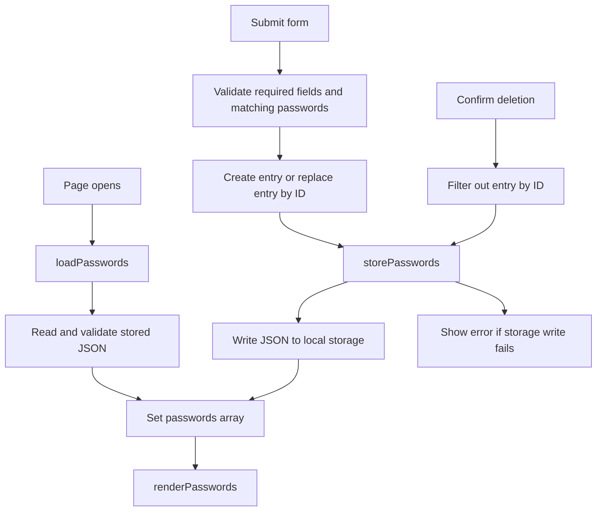

## Application Flow

```mermaid
flowchart TD
    A[Page opens] --> B[loadPasswords]
    B --> C[Read and validate stored JSON]
    C --> D[Set passwords array]
    D --> E[renderPasswords]
    F[Submit form] --> G[Validate required fields and matching passwords]
    G --> H[Create entry or replace entry by ID]
    I[Confirm deletion] --> J[Filter out entry by ID]
    H --> K[storePasswords]
    J --> K
    K --> L[Write JSON to local storage]
    L --> D
    K --> M[Show error if storage write fails]
```
